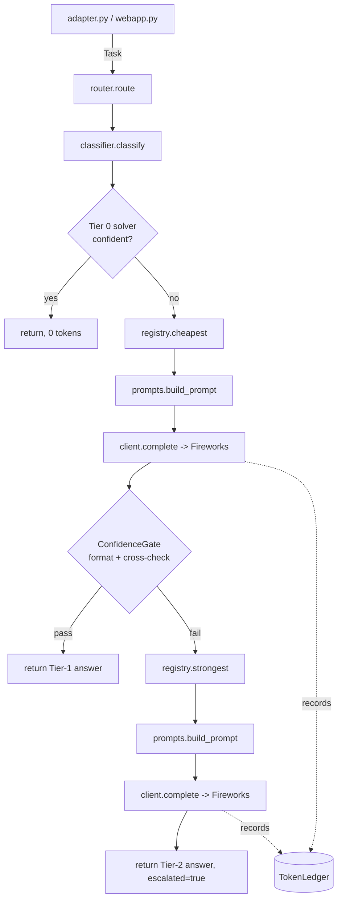

# ARCHITECTURE

System design and data flow for the routing agent, drawn from `PLAN.md` §3
and the code in `src/routing_agent/`. For results and quickstart, see
[README.md](README.md). For threat model, see [SECURITY.md](SECURITY.md).

## 1. Module-by-module walkthrough

| Module | Responsibility |
|---|---|
| `config.py` | `Settings.from_env()` (API key/base URL/`ALLOWED_MODELS`/policy path); `Policy` + `load_policy()` (YAML routing knobs); `parse_allowed_models()` tolerant env-var parsing (comma list, JSON array, bare/prefixed names). |
| `models.py` | Shared pydantic types: `Task` (tolerant field-alias input), `RouteDecision`, `Result`, `CallRecord`. The stable boundary between the unknown harness and the rest of the system. |
| `registry.py` | `ModelInfo` metadata (price, tier, capabilities, `quality_rank`, `prompt_overhead_tokens`, `reasoning_profile`, `min_viable_max_tokens`) for 8 known Fireworks models + 7 Gemma variants; `resolve_allowed()` intersects with `ALLOWED_MODELS` (heuristic inference for unknown ids); `cheapest()`/`strongest()` selection with Gemma tiebreak. |
| `client.py` | `FireworksClient` — thin `openai` SDK wrapper. Merges `reasoning_profile` into the request, floors `max_tokens` at `min_viable_max_tokens`, retries once with `max_tokens × 3` on empty content, records every call (including retries) into `TokenLedger`. |
| `classifier.py` | `classify(prompt) -> TaskType` — zero-token, ordered regex/heuristic rules over 11 task types. Falls back to `GENERAL` rather than guessing. |
| `solvers/` | Tier-0 resolvers, one module per type: `arithmetic.py` (AST-based safe eval), `dates.py`, `strings.py`, `units.py`, `extraction.py`. Each exposes `try_solve(task, task_type) -> SolverResult(answer, confident)`; only fires when it can fully parse the ask. |
| `prompts.py` | `build_prompt(task_type, prompt_text, policy) -> PromptSpec` — per-type system text (≤12 words or none), policy-driven `max_tokens`, `"\n"` stop sequence for single-line answer types. |
| `router.py` | `route()` — the cascade orchestrator: Tier 0 → Tier 1 (`cheapest` + `ConfidenceGate`) → Tier 2 (`strongest`, single escalation, always accepted). |
| `adapter.py` | The only harness-facing module. `/input/tasks.json` → `/output/results.json` (or `--input`/`--output`/stdin). Input-size/count guards (`MAX_INPUT_BYTES`=50MB, `MAX_TASKS`=10,000). Logs a run summary to stderr, never into the results file. |
| `webapp.py` | FastAPI demo: `POST /solve`, `GET /api/stats`, `GET /healthz`, `GET /` (inline dashboard). Reuses `router.route()` unchanged; adds a per-IP rate limiter and a daily spend cap for public-demo safety. |

## 2. Routing decision flow — one worked example per tier

All three examples are real tasks from `evals/evalset/*.jsonl`, with
outcomes taken from the committed `evals/reports/tuned-live.json`.

### Tier 0 — zero tokens

`arithmetic-006`: *"What is 847 * 36?"* → `classify()` matches
`_ARITHMETIC_EXPR_RE`/keyword patterns → `TaskType.ARITHMETIC` →
`solvers/arithmetic.py` strips the leading `"What is"`, parses `847 * 36`
via `ast.parse(mode="eval")`, walks the whitelisted node types
(`BinOp`/`Constant`/`Mult`), evaluates to `30492`, returns
`SolverResult(answer="30492", confident=True)`. `router.route()` returns
immediately — `RouteDecision(tier=0, model=None)`. **0 tokens, 0 calls.**

### Tier 1 — cheapest adequate model, confidence gate passes

`classification-001` (category `classification`, capability tag
`classification`): `registry.cheapest("classification", allowed_models)`
selects `gpt-oss-20b` (blended price $0.185/M vs. `gpt-oss-120b`'s
$0.375/M, both declare the capability). `prompts.build_prompt` sends
`{"role": "system", "content": "Answer with only the label."}` +
the task prompt, `max_tokens=8` (policy `classification` bucket, floored to
`gpt-oss-20b`'s `min_viable_max_tokens=128` by the client),
`reasoning_effort="low"`, stop=`["\n"]`. The model returns a short label.
`_validate_format` (`TaskType.CLASSIFICATION` → ≤3 words) passes;
`_cross_check` returns `True` (no Tier-0 solver exists for classification,
so the secondary signal is a no-op pass-through). `RouteDecision(tier=1,
model="gpt-oss-20b", confident=True)`.

### Tier 2 — single escalation

`multiple_choice-008`: *"What is the smallest prime number? A) 0 B) 1 C)
2 D) 3"* (expected: `C`). Routed to Tier 1 (`gpt-oss-20b`, cheapest for
`classification` capability); the report shows `route:
"tier2:accounts/fireworks/models/deepseek-v4-pro"`, `escalated: true` —
the Tier-1 answer failed the confidence gate (this task type ships tricky
edge-case phrasing, e.g. whether `1` reads as prime), so `router.route()`
called `registry.strongest(allowed_models)` (highest `quality_rank`,
`deepseek-v4-pro`, rank 9), rebuilt the same minimal prompt, and issued
**one** more call with `reasoning_effort="none"`. The Tier-2 answer is
accepted unconditionally — `RouteDecision(tier=2, model="deepseek-v4-pro",
escalated=True)`. Total for this task: 2 model calls, never 3+.

## 3. Confidence gate design

`router._validate_format` (**PRIMARY**) and `router._cross_check`
(**SECONDARY**) implement the gate that decides whether a Tier-1 answer is
accepted or the task escalates to Tier 2:

- **PRIMARY — format validation** (`_validate_format`): type-specific
  cheap sanity checks with no network cost — classification labels ≤3
  words, multiple-choice answers ≤3 chars, arithmetic/unit-conversion
  answers must contain a digit. Anything else (short_qa, code,
  summarization, general) only requires non-empty output. This alone
  gates most failures cheaply.
- **SECONDARY — cross-check** (`_cross_check`): for task types that also
  have a Tier-0 solver (arithmetic, date_math, string_op,
  unit_conversion, extraction), re-runs the Tier-0 solver against the same
  prompt and string-compares (normalized: stripped, lowercased, trailing
  `.` removed) to the model's answer. If the solver isn't confident, or no
  solver exists for the type, this check passes through (`True`) rather
  than blocking — it is a *corroborating* signal, never a sole rejector.
- **Logprob secondary signal — unwired by design.** `PLAN.md` §3 and
  `Policy.logprob_threshold` describe a second secondary signal: answer-
  token logprobs. Probed live (`PLAN.md` §2): Fireworks returns logprobs
  for all evaluated candidates, but the stream interleaves reasoning-
  channel tokens with answer tokens, so only the trailing answer tokens
  are meaningful — and format validation + Tier-0 cross-check already
  cover the gate's precision needs on the 200-task evalset (99.5%
  accuracy, one grading-artifact miss). `logprob_threshold` stays in the
  `Policy` schema as a forward-compatible knob; wiring it up is a
  follow-on, not a blocker, since the current two-signal gate already
  meets SC1.

## 4. TokenLedger accounting

`client.py::TokenLedger` is a plain accumulator (`list[CallRecord]`), one
instance per router/eval/webapp run — not a global singleton, so
concurrent eval runs and demo requests never cross-contaminate totals.

- **Every `complete()` call is recorded**, including the empty-content
  retry (`client._call(..., retry=True)`), so `total_raw_tokens` always
  reflects true billed usage, not just "successful" calls. The tuned-live
  report shows `retried_calls: 2` out of `total_calls: 138` — both retries
  are counted in `total_raw_tokens: 17157`.
- **Raw accounting**: `TokenLedger.total_raw_tokens` sums
  `prompt_tokens + completion_tokens` across all records — the primary
  scoring-metric assumption (`ASSUMPTIONS.md` #5: "scoring metric: raw
  total tokens, not price-weighted").
- **Price-weighted accounting**: `TokenLedger.total_price_weighted(models)`
  multiplies each record's prompt/completion tokens by the model's
  `price_in`/`price_out` from the registry — a hedge against the scoring
  metric turning out to be cost-based instead of token-based. Calls
  against a model id absent from the supplied `models` dict contribute
  zero (a defensive default, not a crash) since this is a secondary
  metric.
- **Cached tokens** (`usage.prompt_tokens_details.cached_tokens`, live-
  probed as present on every Fireworks response) are recorded on
  `CallRecord` but not currently subtracted from billed totals anywhere —
  informational only today.

## 5. ADRs

### ADR-1: Tiered cascade over single-model routing

**Context.** The leaderboard scores token count and accuracy jointly; a
single strong model would maximize accuracy but spend tokens on tasks a
regex or a $0.02/M model could solve just as correctly.

**Decision.** Route every task through a 3-tier cascade — deterministic
solver (free) → cheapest adequate model → single escalation to the
strongest model — rather than a uniform model choice or a multi-round
agent loop.

**Consequences.** 32.5% of the evalset costs zero tokens; the remaining
tasks pay for at most 2 model calls. This caps worst-case cost per task at
a known bound (no runaway loops) but adds routing-logic surface area
(classifier + confidence gate) that itself needs test coverage and can
misroute (mitigated by precision-first Tier-0 solvers and CI regression
tests over `classifier.py`).

### ADR-2: Adapter isolation for the unknown harness contract

**Context.** The real scoring harness's I/O contract (schema, field names,
`ALLOWED_MODELS` format) was unpublished at build time (`ASSUMPTIONS.md`
#1–#3); guessing wrong anywhere in the core would mean a scattered rewrite
under a hard deadline.

**Decision.** Confine 100% of harness-facing I/O to `adapter.py` — file/
stdin reading, JSON parsing, alias-tolerant field mapping (via `Task`'s
pydantic validator), and `results.json` writing. Every other module only
ever sees the normalized `Task`/`Result` pydantic types.

**Consequences.** If the real spec differs from the assumed
`/input/tasks.json` → `/output/results.json` contract, only `adapter.py`
changes — router, classifier, solvers, registry, and their tests are
untouched. The cost is one extra indirection layer (`_read_tasks`/
`_parse_tasks`) that must stay in sync with `Task`'s alias list
(`prompt`/`input`/`question`/`text`).

### ADR-3: Reasoning suppression as first-class registry metadata

**Context.** Live probing (`PLAN.md` §2) found `gpt-oss-20b` burns
completion-token budget on hidden `reasoning_content` before emitting any
visible answer — a tight `max_tokens` cap silently returns empty content.
Different models need different suppression params (`reasoning_effort`)
and different minimum caps to avoid truncating mid-reasoning.

**Decision.** Store `reasoning_profile` (dict of extra request params) and
`min_viable_max_tokens` directly on each `ModelInfo` in `registry.py`,
merged into every request by `client.complete()` and floored against the
caller-supplied cap, rather than handling this as call-site special-casing
or a single global setting.

**Consequences.** Adding a new model only requires one `ModelInfo` entry
with an eval-tuned profile; the router and prompts stay model-agnostic.
The tradeoff is that these profiles are empirically tuned constants
(comments in `registry.py` cite the exact probed completion-token counts
that motivated each value, e.g. 128 vs. 96 for gpt-oss) — they can go
stale if Fireworks changes a model's template and need periodic
re-verification via the eval ladder.

### ADR-4: Honest baseline for SC2 (`apply_reasoning_profile` bypass)

**Context.** SC2 (≥60% token reduction, stretch) needs a believable "naive
deployment" comparison bar. A baseline that reused this router's own
reasoning-suppression tuning would overstate real-world savings — it
would not reflect what an unoptimized deployment (generic prompt,
strongest model, default cap) actually costs.

**Decision.** `client.complete(..., apply_reasoning_profile=False)` is a
first-class parameter, not a hack: `evals/run_eval.py --baseline` passes
`False` explicitly so the comparison run reflects a genuinely naive
deployment (strongest allowed model, `"Answer the following."` prompt,
`max_tokens=512`, no reasoning suppression) rather than "generic prompt +
this router's own tuning."

**Consequences.** The measured baseline (163–174 tokens/task,
extrapolated ~32,600–34,800 tokens/200 tasks) vs. the tuned live run
(17,157 tokens/200 tasks) gives an honest **~47–51% reduction** — short of
the 60% stretch target, but defensible under scrutiny, since the
comparison bar isn't quietly benefiting from the same optimizations being
measured against it. The cost is a slightly more complex client API
surface (one extra boolean parameter) to keep both code paths in the same
function rather than duplicating request-building logic.
